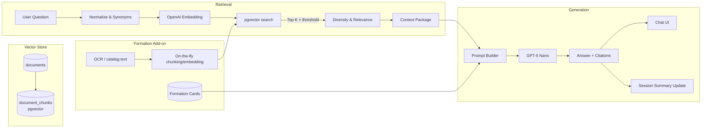

# Knowledge Base Workflow

Visual overview of how a document flows through the BIAT assistant, followed by a simplified RAG architecture diagram you can drop into slides.

```mermaid
flowchart LR
    A[Upload / Scan] -->|Metadata + files| B[Documents DB]
    A -->|OCR (if scan)| C[OCR Text]
    B --> D[Ingestion\nChunk + Embed]
    D --> E[document_chunks (pgvector)]
    C --> D
    subgraph Chat Flow
      U[User question] --> NQ[Normalize + Summary]
      NQ --> R[RagService<br/>pgvector search]
      R -->|Context| LLM[GPT-5 Nano<br/>OpenAI]
      LLM --> Ans[Answer + Sources]
      Ans --> UI[Chat UI]
      Ans -->|Formation intent?| Cards[Formation Cards]
    end
    Cards --> UI
    R <-- Formation catalogue --> CatAPI[/POST /formations/catalogue/query/]
```

---

## Stage-by-Stage Detail

### 1. Document Intake
| Step | Description |
|------|-------------|
| Upload | HR/Legal admin uploads PDF/DOCX via UI; metadata stored in `documents`, file saved under `UPLOAD_DIR`. |
| OCR | For scans/images, `OcrService` runs (`pdf-parse` or Tesseract) and saves extracted text (`document.ocrText`). |

### 2. Ingestion & Embeddings
1. `IngestionService` parses text + metadata.
2. Text is chunked (800 chars, 150 overlap) and each chunk receives an embedding via OpenAI `text-embedding-3-small`.
3. Chunks + vectors reside in `document_chunks` (pgvector column).
4. After review, documents move to `published` status.

### 3. Retrieval-Augmented Generation (RAG)
| Action | Detail |
|--------|--------|
| Normalize question | Handles “c quoi…”, synonyms (e.g., style/dress code). |
| Vector search | `RagService` embeds query, applies boosts + diversity, and tracks whether similarity passes the threshold. |
| No-context guardrail | If nothing passes the threshold, chat replies with “information introuvable” to avoid hallucinations. |

### 4. Chat Orchestration
1. `chat_messages` records every turn; last few exchanges feed context.
2. `chat_sessions.contextSummary` stores a compact summary updated after each assistant response.
3. Casual messages bypass RAG; formation queries trigger catalogue cards (`sourceRefs` include card metadata).

### 5. LLM Prompting
- `OpenAIProvider` enforces French-only, direct answers with caution on uncertain info.
- Same summary + history feed GPT-5 Nano, which generates the final answer.
- Source references (document chunks + formation cards) are returned to the UI.

### 6. Formation Catalogue (Ad-hoc Flow)
| Step | Description |
|------|-------------|
| OCR text | Run OCR locally or via the OCR module; keep the raw text. |
| API call | `POST /api/formations/catalogue/query` with `ocrText` or `documentId`. |
| Result | Service chunks/embeds on the fly, picks 5 chunks, calls GPT-5 Nano, and returns an answer without permanently ingesting the document. |

### 7. Monitoring
- `GET /admin/system/status` checks database stats + OpenAI endpoint/model availability.
- Frontend dashboard displays provider, endpoint, configured model, and the five visible models returned by OpenAI.

---

## Quick Reference Matrix

| Stage | Purpose | Components |
|-------|---------|------------|
| Upload / OCR | Capture text + metadata | `DocumentsService`, `OcrService`, `documents`, `document.ocrText` |
| Ingestion | Prepare chunks & embeddings | `IngestionService`, `document_chunks`, OpenAI embeddings |
| Retrieval | Find relevant context | `RagService`, pgvector, similarity threshold + diversity |
| Memory / Prompt | Provide conversation context | `chat_sessions.contextSummary`, recent messages, prompt builder |
| Generation | Produce cited French answers | `OpenAIProvider`, GPT-5 Nano |
| Formation Catalogue | Optional on-the-fly answers | `FormationsService`, `/api/formations/catalogue/query`, cards |

Use this map in presentations to show each hop in the workflow—from raw document to trustworthy, cited answers in the chat interface. Feel free to extend the Mermaid diagram with additional swimlanes or colors if you need more visual detail.

---

## RAG Architecture Schema


### Description
- **Normalization & Synonyms:** removes filler phrases (“c’est quoi…”) and aligns synonyms (style/dress code) to improve recall.
- **Embedding + Search:** OpenAI embeddings feed pgvector similarity; results below the threshold trigger the “information introuvable” fallback.
- **Diversity Filter:** ensures no single document dominates results; boosts recent or formation-tagged documents.
- **Prompt Builder:** injects retrieved context, conversation summary, recent turns, and formation cards before sending to GPT-5 Nano.
- **Formation Add-on:** either uses pre-published cards or dynamically chunks OCR text from catalogues, converging back into the same RAG pipeline.

Use this schema as a dedicated “RAG Architecture” slide: the diagram focuses on the retrieval/generation loop, while the earlier workflow diagram covers intake and monitoring.
